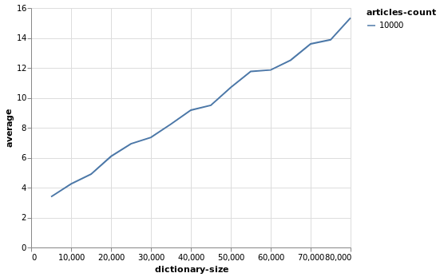
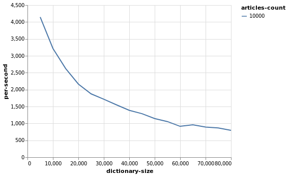
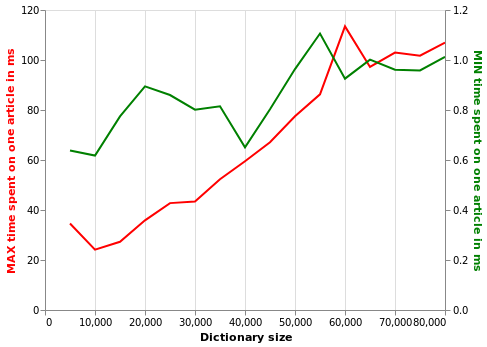

<a href="http://www.tokenmill.lt">
      
</a>

# Beagle

[](https://opensource.org/licenses/Apache-2.0)
[](https://gitlab.com/tokenmill/oss/beagle/pipelines/master/latest)
[](https://search.maven.org/search?q=g:%22lt.tokenmill%22%20AND%20a:%22beagle%22)

Beagle is a detector of interesting things in text. Its intended use is in-stream search applications. Suppose you need to monitor a stream of text documents such as web crawl results, chat messages, or corporate documents in order to identify keywords, phrases, regexes, and [complex search queries](https://lucene.apache.org/core/2_9_4/queryparsersyntax.html) of interest. With Beagle you can quickly be up and running with such a system, allowing you to focus on productively monitoring your documents.

Beagle is based on the [Lucene monitor](https://github.com/apache/lucene-solr/tree/master/lucene/monitor) library which is based on [Luwak](https://github.com/flaxsearch/luwak).

## Components

- [Phrase highlighter with support for](#phrase-annotator-usage):
  - case sensitivity,
  - ascii folding,
  - stemming support for various languages,
  - phrase slop,
  - synonymous phrases,
  - metadata,
  - any combination of previously mentioned features.
- [Java interface to the phrase highlighter](#java-interface-to-the-phrase-highlighter)
- (alpha!) [Lucene query string support](#lucene-query-support) (interface is subject to change)
- [Dictionary file readers (csv, json, edn)](#dictionary-readers)
- [Dictionary validator](#dictionary-validator)
- [Dictionary optimizer](#dictionary-optimizer)
- [Annotation merger](#annotation-merger)

## Phrase Annotator Usage

```clojure
(require '[beagle.phrases :as phrases])

(let [dictionary [{:text "to be annotated" :id "1"}]
      highlighter-fn (phrases/highlighter dictionary)]
  (highlighter-fn "before annotated to be annotated after annotated"))
=> ({:text "to be annotated", :type "LABEL", :dict-entry-id "1", :meta {}, :begin-offset 17, :end-offset 32})

;; Case sensitivity is controlled per dictionary entry 
(let [dictionary [{:text "TO BE ANNOTATED" :id "1" :case-sensitive? false}]
      highlighter-fn (phrases/highlighter dictionary)]
  (highlighter-fn "before annotated to be annotated after annotated"))
=> ({:text "to be annotated", :type "LABEL", :dict-entry-id "1", :meta {}, :begin-offset 17, :end-offset 32})

;; ASCII folding is controlled per dictionary entry
(let [dictionary [{:text "TÖ BE ÄNNÖTÄTED" :id "1" :case-sensitive? false :ascii-fold? true}]
      highlighter-fn (phrases/highlighter dictionary)]
  (highlighter-fn "before annotated to be annotated after annotated"))
=> ({:text "to be annotated", :type "LABEL", :dict-entry-id "1", :meta {}, :begin-offset 17, :end-offset 32})

;; Stemming is supported for multiple languages per dictionary entry
(let [dictionary [{:text "Kaunas" :id "1" :stem? true :stemmer :lithuanian}]
      highlighter-fn (phrases/highlighter dictionary)]
  (highlighter-fn "Kauno miestas"))
=> ({:text "Kauno", :type "PHRASE", :dict-entry-id "1", :meta {}, :begin-offset 0, :end-offset 5})

;; Phrases also support slop (i.e. terms edit distance) per dictionary entry
(let [txt "before start and end after"
      dictionary [{:text "start end" :id "1" :slop 1}]
      highlighter-fn (phrases/highlighter dictionary)]
  (highlighter-fn txt))
=> ({:text "start and end", :type "PHRASE", :dict-entry-id "1", :meta {}, :begin-offset 7, :end-offset 20})
```

## Java Interface to the Phrase Highlighter

Example:
```java
import lt.tokenmill.beagle.phrases.Annotation;
import lt.tokenmill.beagle.phrases.Annotator;
import lt.tokenmill.beagle.phrases.DictionaryEntry;

import java.util.Arrays;
import java.util.Collection;
import java.util.HashMap;

public class Main {
    public static void main(String[] args) {
        DictionaryEntry dictionaryEntry = new DictionaryEntry("test phrase");
        Annotator annotator = new Annotator(Arrays.asList(dictionaryEntry));
        Collection<Annotation> annotations = annotator.annotate("This is my test phrase");
        annotations.forEach(s -> System.out.println("Annotated: \'" + s.text() + "\' at offset: " + s.beginOffset() + ":" + s.endOffset()));
    }
}

// => Annotated: 'test phrase' at offset: 11:22
```

The available options for the Java API are explained with examples in the [Java Interface for Phrase Highlighting wiki page](https://github.com/tokenmill/beagle/wiki/Java-Interface-for-Phrase-Highlighting).

All the options that are present in the Clojure interface are also available for use in Java, just convert Clojure keywords to Java strings, e.g.
```
:case-sensitive? => "case-sensitive?"
```  

### Project Setup with Maven

The library is deployed in the Maven Central Repository and you can just add the beagle dependency to your `pom.xml`:

```xml
<dependency>
    <groupId>lt.tokenmill</groupId>
    <artifactId>beagle</artifactId>
    <version>0.3.1</version>
</dependency>
```

## Lucene Query Support

Examples: 

```clojure
(require '[beagle.lucene-alpha :as lucene])

(let [txt "some text this other that"
        dictionary [{:text "this AND that" :id "1" :slop 1}]
        annotator-fn (lucene/annotator dictionary)]
  (annotator-fn txt {}))
=> ({:text "this AND that", :type "QUERY", :dict-entry-id "1", :meta {}})
```

## Performance

The performance was measured on a desktop PC with Ubuntu 19.04 and 8-core Ryzen 1700.
 
The test setup was for news articles and dictionary made up of names of city names in USA.

Code and data for benchmarking and more benchmarks can be found [here](https://github.com/tokenmill/beagle-performance-benchmarks).

### Single-thread

Average time spent per document ranged from 1.58 ms for dictionary of 5k phrases to 4.58 ms per document for 80k phrases.


Throughput of docs analyzed ranged from 626 docs/sec for dictionary of 5k phrases to 210 docs/sec for 80k phrases.


Max time spent per document has couple of spikes when processing a document takes ~1000ms. These spikes should 
have been caused either by GC pauses, or JVM deoptimizations. Aside from those spikes, max time ranges grows steadily
from 15 ms to 72 ms as the dictionary size grows. 

Min time spent per document is fairly stable for any dictionary size and is about 0.45 ms. Most likely these are the
cases when [Presearcher](https://lucene.apache.org/core/8_2_0/monitor/index.html) haven't found any candidate queries to run against the document. 


### Multi-threaded

Using `core.async` pipeline time spent per single doc ranged from 3.38 ms for dictionary of 5k phrases to 15.34 ms per document for 80k phrases.



Total time spent to process all 10k docs ranged from 2412 ms for dictionary of 5k phrases to 12595 ms per document for 80k phrases.


Throughput of docs analyzed ranged from 4143 docs/sec for dictionary of 5k phrases to 793 docs/sec for 80k phrases.



Max time spent per document has risen fairy steady from 24.15 ms for dictionary of 10k phrases to 113.45 ms per document for 60k phrases.

Min time spent per document varied from 0.6 ms for dictionary of 10k phrases to 1.1 ms per document for 55k phrases.



### Conclusions about Performance

Processing of a one document on average is faster in the single-thread mode by roughly by 3x compared to multi-threaded mode but even 
in multi-threaded mode one document rarely takes more than 10 ms. 

In multi-threaded mode throughput grows with the number on CPU cores almost linearly: 4143/8=518 docs per core per sec in multi-threaded mode
while in single-thread mode 626 docs per core per sec.

## Dictionary Readers

Three file formats are supported: csv, edn, json.

### CSV Dictionary Format

Separator: ","
Escape: "\""

The first line *MUST* be a header.

Supported header keys: `["text" "type" "id" "synonyms" "case-sensitive?" ":ascii-fold?" "meta"]`

Order is not important.

Under `synonyms`, there should be a list of string separated by ";"
Under `meta`, there should be a list of strings separated by ";". Even number of strings is expected. In case of odd number, last one is ignored.

## Dictionary Validator

Accepts any number of dictionaries to validate as long as they are provided in pairs as '"/path/to/dictionary/file" "file-type"'

### Supported File Types

- csv
- json
- edn

### Output

- If any dictionary is invalid exception will be thrown with exit status 1

### Usage

#### Clojure

To use validator directly execute command: `clj -m beagle.validator "/path/to/dictionary/file" "file-type" "/path/to/dictionary/file2" "file-type" & ...`

##### Example:

```
clj -m beagle.validator "your-dict.csv" "csv" "your-other-dict.json" "json"
```

#### Docker

Example in Gitlab CI:

```
validate-dictionaries:
  stage: dictionary-validation
  when: always
  image: registry.gitlab.com/tokenmill/clj-luwak/dictionary-validator:2
  script:
    - >
      dictionary-validator
      /path/to/dict.csv csv
      /path/to/dict.json json
      /path/to/dict.edn edn
```

## Dictionary Optimizer

Supported optimizations:
- Remove duplicate dictionary entries
- Merge synonyms
- Synonyms and text equality check

There are cases when dictionary entries can't be merged:
- Differences in text analysis

Examples:
```clojure
(require '[beagle.dictionary-optimizer :as optimizer])

; Remove duplicates
(let [dictionary [{:text "TO BE ANNOTATED" :id "1"}
                  {:text "TO BE ANNOTATED"}]]
  (optimizer/optimize dictionary))
=> ({:text "TO BE ANNOTATED", :id "1"})

; Merge synonyms
(let [dictionary [{:text "TO BE ANNOTATED" :synonyms ["ONE"]}
                  {:text "TO BE ANNOTATED" :synonyms ["TWO"]}]]
  (optimizer/optimize dictionary))
=> ({:text "TO BE ANNOTATED", :synonyms ("TWO" "ONE")})

; Synonyms and text equality check
(let [dictionary [{:text "TO BE ANNOTATED" :synonyms ["TO BE ANNOTATED"]}]]
  (optimizer/optimize dictionary))
=> ({:text "TO BE ANNOTATED", :synonyms ["TO BE ANNOTATED"]})

; Can't be merged because of differences in text analysis
(let [dictionary [{:text "TO BE ANNOTATED" :case-sensitive? true}
                  {:text "TO BE ANNOTATED" :case-sensitive? false}]]
  (optimizer/optimize dictionary))
=> ({:text "TO BE ANNOTATED", :case-sensitive? true} {:text "TO BE ANNOTATED", :case-sensitive? false})
```

## Annotation Merger

Only annotations of the same type are merged.

Handled cases:
- Duplicate annotations
- Nested annotations

Examples:
```clojure
(require '[beagle.annotation-merger :as merger])

(let [dictionary [{:text "TEST"}
                  {:text "This TEST is"}]
      highlighter-fn (phrases/highlighter dictionary)
      annotations (highlighter-fn "This TEST is")]
  (println "Annotations: " annotations)
  (merger/merge-same-type-annotations annotations))
Annotations:  ({:text TEST, :type PHRASE, :dict-entry-id 0, :meta {}, :begin-offset 5, :end-offset 9} {:text This TEST is, :type PHRASE, :dict-entry-id 1, :meta {}, :begin-offset 0, :end-offset 12})
=> ({:text "This TEST is", :type "PHRASE", :dict-entry-id "1", :meta {}, :begin-offset 0, :end-offset 12})

;; You can also inline the need of merging annotations
(let [dictionary [{:text "TEST"}
                  {:text "This TEST is"}]
      highlighter-fn (phrases/highlighter dictionary)]
  (highlighter-fn "This TEST is" {:merge-annotations? true}))
=> ({:text "This TEST is", :type "PHRASE", :dict-entry-id "1", :meta {}, :begin-offset 0, :end-offset 12})
```

## License

Copyright &copy; 2019 [TokenMill UAB](http://www.tokenmill.lt).

Distributed under the The Apache License, Version 2.0.
